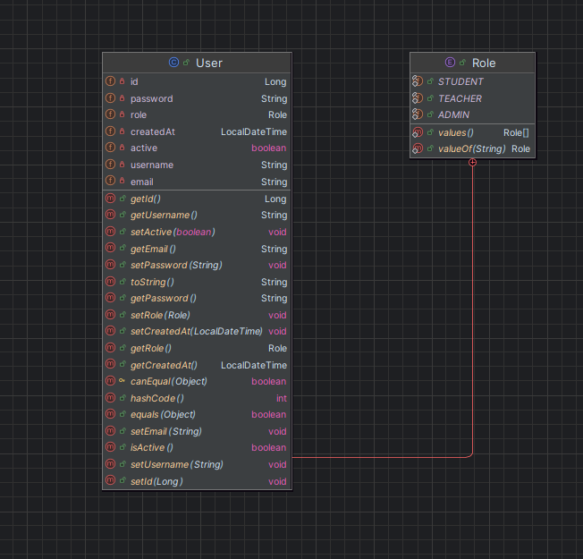
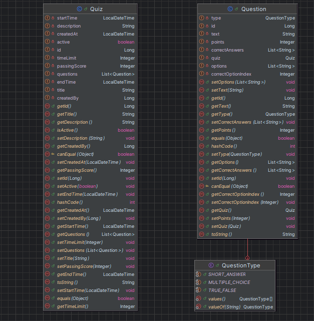
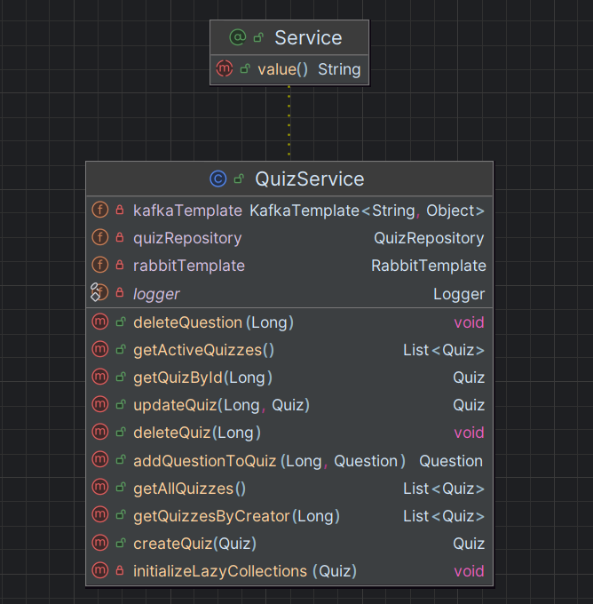

#  Quiz Platform

A quiz platform demonstrating microservices architecture 

## System Architecture

### System Context

```
┌────────────────────────────────────────────────────────────────┐
│                    Quiz Platform System                        │
│                                                                │
│  External Users (Admins, Students, Teachers)                   │
│           ↕                                                    │
│  ┌─────────────────────────────────────────────────────────┐   │
│  │  Quiz Platform Microservices                            │   │
│  │  - Quiz Management                                      │   │
│  │  - Auto-Grading                                         │   │
│  │  - Real-time Notifications                              │   │
│  │  - Performance Analytics                                │   │
│  │  - Scalable Infrastructure                              │   │
│  └─────────────────────────────────────────────────────────┘   │
│                                                                │
└────────────────────────────────────────────────────────────────┘
```

### Container Diagram

```
┌──────────────────────────────────────────────────────────────────────┐
│                    Quiz Platform Deployment                          │
│                                                                      │
│  ┌────────────────────────────────────────────────────────────────┐  │
│  │                    External Users                              │  │
│  │              (Browser - HTTP/WebSocket)                        │  │
│  └────────────────────────────────────────────────────────────────┘  │
│                              ▲                                       │
│                              │                                       │
│                    ┌─────────▼───────────┐                           │
│                    │   Nginx (Port 80)   │                           │
│                    │   Reverse Proxy     │                           │
│                    │                     │                           │
│                    │  Routes:            │                           │
│                    │  / → Frontend:80    │                           │
│                    │  /api/* → Gateway   │                           │
│                    │  /ws → Notification │                           │
│                    └────────┬────────────┘                           │
│                             │                                        │
│          ┌──────────────────┼──────────────────┐                     │
│          │                  │                  │                     │
│  ┌───────▼──────┐  ┌────────▼────────┐  ┌──────▼───────┐             │
│  │  Frontend    │  │  API Gateway    │  │ Notification │             │
│  │  (React)     │  │  (8080)         │  │ Service      │             │
│  │  Port: 3000  │  │  - Routing      │  │ (8084)       │             │
│  │              │  │  - JWT Auth     │  │ - WebSocket  │             │
│  │ - Dashboard  │  │  - Rate limit   │  │ - STOMP/SockJS             |
│  │ MicroFE(3001)│  └────────┬────────┘  └──────────────┘             │
│  │ - Quiz       │           │                                        │
│  │ MicroFE(3002)│           │                                        │
│  │ - Admin      │           │                                        │
│  │ MicroFE(3003)│           │                                        │   
│  └──────────────┘           │                                        │
│                             │                                        │
│          ┌──────────────────┼──────────────────┐                     │
│          │                  │                  │                     │
│   ┌──────▼──────┐   ┌───────▼────┐    ┌────────▼─────┐               │
│   │ User        │   │ Quiz       │    │ Submission   │               │
│   │ Service     │   │ Service    │    │ Service      │               │
│   │ (8081)      │   │ (8082)     │    │ (8083)       │               │
│   │             │   │            │    │              │               │
│   │ - Register  │   │ - CRUD     │    │ - Submit     │               │
│   │ - Login     │   │ - Questions│    │ - Grade      │               │
│   │ - Profile   │   │ - Validate │    │ - Analytics  │               │
│   └──────┬──────┘   └──────┬─────┘    └──────┬───────┘               │
│          │                 │                 │                       │
│   ┌──────▼──────┐   ┌──────▼────┐    ┌───────▼──────┐                │
│   │ Analytics   │   │  Grading  │    │ Kafka        │                │
│   │ Service     │   │  Function │    │ Consumer     │                │
│   │ (8085)      │   │  (9000)   │    │              │                │
│   │             │   │           │    │ - Events     │                │
│   │ - Stats     │   │ - AutoGrade    │ - Streams    │                │
│   └─────────────┘   └───────────┘    └──────────────┘                │
│                                                                      │
│  ┌────────────────────────────────────────────────────────────────┐  │
│  │              Data & Messaging Infrastructure                   │  │
│  │                                                                │  │
│  │  ┌──────────┐  ┌──────────┐  ┌───────────────┐                 │  │
│  │  │PostgreSQL│  │ MongoDB  │  │   RabbitMQ    │                 │  │
│  │  │(5432)    │  │(27017)   │  │   (5672)      │                 │  │
│  │  │          │  │          │  │               │                 │  │
│  │  │ - Users  │  │ - Quiz   │  │ - Grading Q   │                 │  │
│  │  │ - Submis.│  │ - Analyt.│  │ - Notifications│                │  │
│  │  └──────────┘  └──────────┘  └───────────────┘                 │  │
│  │                                                                │  │
│  │  ┌──────────────────────────────────────────────────────────┐  │  │
│  │  │     Kafka + Zookeeper (Event Streaming)                  │  │  │
│  │  │                                                          │  │  │
│  │  │  Topics:                                                 │  │  │
│  │  │  - submission-events    (Quiz submissions)               │  │  │
│  │  │  - grading-events       (Auto-grading results)           │  │  │
│  │  │  - analytics-events     (User interactions)              │  │  │
│  │  └──────────────────────────────────────────────────────────┘  │  │
│  │                                                                │  │
│  └────────────────────────────────────────────────────────────────┘  │
│                                                                      │
└──────────────────────────────────────────────────────────────────────┘
```

### Microservices 
1. **API Gateway** (Port 8080) - Request routing, JWT validation, rate limiting
2. **User Service** (Port 8081) - Authentication, user management, authorization
3. **Quiz Service** (Port 8082) - Quiz CRUD, question management
4. **Submission Service** (Port 8083) - Quiz attempts, records their answers, sends them for grading, stores results
5. **Notification Service** (Port 8084) - WebSocket real-time notifications 
6. **Analytics Service** (Port 8085) - Event processing from Kafka, statistics
7. **Grading Function** (Port 9000) - Serverless auto-grading (FaaS)
8. **Kafka Consumer** - Async event stream processing

### Infrastructure Components
- **PostgreSQL** (5432) - Relational databases (users, submissions)
- **MongoDB** (27017) - Document storage (quizzes, analytics)
- **RabbitMQ** (5672/15672) - Message broker (grading, notifications)
- **Kafka** (9092) - Event streaming platform
- **Zookeeper** (2181) - Kafka coordination
- **Nginx** (80) - Reverse proxy, single entry point for all client requests

---

###  **Secured REST API using JWT authentication **

#### JWT Authentication Flow
```
Client Request → API Gateway → JWT Validation → Microservice → Database
                    ↓
            (Invalid Token)
                    ↓
                Return 401
```

#### Security Architecture
- **JWT Token Generation**: User Service creates signed tokens on login
- **Token Validation**: API Gateway validates all incoming requests
- **Role-Based Access Control**: STUDENT, TEACHER, ADMIN roles
- **Spring Security**: Integrated with all microservices


#### API Gateway (Validation)
```java
@Configuration
public class SecurityConfig extends WebSecurityConfigurerAdapter {
    @Override
    protected void configure(HttpSecurity http) throws Exception {
        http.csrf().disable()
            .authorizeRequests()
            .antMatchers("/api/users/auth/**").permitAll()
            .antMatchers("/api/quizzes/**").hasAnyRole("STUDENT", "TEACHER")
            .antMatchers("/api/admin/**").hasRole("ADMIN")
            .and()
            .addFilterBefore(new JwtAuthenticationFilter(), 
                UsernamePasswordAuthenticationFilter.class);
    }
}
```

#### Protected REST Endpoints
```bash
# Public endpoints (no auth required)
POST   /api/users/register
POST   /api/users/auth/login

# Protected endpoints (JWT required)
GET    /api/quizzes                       # STUDENT, TEACHER
POST   /api/quizzes                       # TEACHER
PUT    /api/quizzes/{id}                  # TEACHER
DELETE /api/quizzes/{id}                  # TEACHER

POST   /api/submissions/start             # STUDENT
POST   /api/submissions/{id}/submit        # STUDENT
GET    /api/submissions                   # STUDENT , TEACHER

GET    /api/analytics/dashboard           # TEACHER

DELETE /api/admin/users/{id}              # ADMIN
PUT    /api/admin/users/{id}/role         # ADMIN
```

### **Nginx Reverse Proxy - Single Entry Point Architecture**

Nginx serves as the single entry point for all client requests, routing traffic to appropriate backend services. All frontend applications communicate through nginx instead of directly accessing backend services.

**Implementation**:

#### Nginx Configuration

```nginx
# nginx.conf
events {
    worker_connections 1024;
}

http {
    upstream api_gateway {
        # Load balancing across multiple API gateway instances
        server api-gateway:8080;
        # Add more instances for load balancing:
        # server api-gateway-2:8080;
        # server api-gateway-3:8080;
    }

    server {
        listen 80;
        server_name localhost;

        # Enable gzip compression
        gzip on;
        gzip_types text/plain text/css application/json application/javascript text/xml application/xml;

        # API Gateway proxy - All REST API calls
        location /api/ {
            proxy_pass http://api_gateway;
            proxy_set_header Host $host;
            proxy_set_header X-Real-IP $remote_addr;
            proxy_set_header X-Forwarded-For $proxy_add_x_forwarded_for;
            proxy_set_header X-Forwarded-Proto $scheme;
        }

        # WebSocket proxy for real-time notifications
        location /ws {
            proxy_pass http://notification-service:8084;
            proxy_http_version 1.1;
            proxy_set_header Upgrade $http_upgrade;
            proxy_set_header Connection "upgrade";
            proxy_set_header Host $host;
        }

        # Serve frontend static files
        location / {
            proxy_pass http://frontend:80;
            proxy_set_header Host $host;
            proxy_set_header X-Real-IP $remote_addr;
        }
    }
}
```

#### Frontend Configuration

All frontend services use environment variables to route through nginx:

```javascript
// Frontend API Configuration
const API_BASE_URL = process.env.REACT_APP_API_URL || 'http://localhost/api';
const WS_URL = process.env.REACT_APP_WS_URL || 'http://localhost/ws';

// All API calls go through nginx
const api = axios.create({
  baseURL: API_BASE_URL  // http://localhost/api → nginx → api-gateway:8080
});

// WebSocket connections go through nginx
const socket = new SockJS(WS_URL);  // http://localhost/ws → nginx → notification-service:8084
```

#### Docker Compose Configuration

```yaml
# docker-compose.yml
services:
  nginx:
    image: nginx:alpine
    ports:
      - "80:80"
    volumes:
      - ./nginx.conf:/etc/nginx/nginx.conf:ro
    depends_on:
      - api-gateway
      - notification-service
      - frontend
    networks:
      - quiz-network

  frontend:
    build: ./frontend
    environment:
      - REACT_APP_API_URL=http://localhost/api
      - REACT_APP_WS_URL=http://localhost/ws
    networks:
      - quiz-network
```

#### Traffic Flow

```
Browser Request → Nginx (Port 80) → Backend Service
                    ↓
    ┌───────────────┼───────────────┐
    │               │               │
    ▼               ▼               ▼
/api/*          /ws             /
    │               │               │
    ▼               ▼               ▼
API Gateway   Notification    Frontend
 (8080)       Service (8084)   (80)
```

### **Message Broker - RabbitMQ** 

The Submission Service publishes grading requests to the queue, and the Grading Service consumes them, processes the submissions, and sends back the results. Port 5672 handles the actual messages, while 15672 provides a web UI for monitoring queues.

**Implementation**:

#### RabbitMQ Configuration
```yaml
# docker-compose.yml
rabbitmq:
  image: rabbitmq:3.12-management-alpine
  ports:
    - "5672:5672"    
    - "15672:15672"  
  environment:
    RABBITMQ_DEFAULT_USER: guest
    RABBITMQ_DEFAULT_PASS: guest
```

#### Message Producer (Submission Service)
```java
@Service
public class SubmissionService {
    @Autowired
    private RabbitTemplate rabbitTemplate;
    
    public void submitQuiz(Submission submission) {
        Submission savedSubmission = submissionRepository.save(submission);

        // Send to RabbitMQ for async grading
        GradingRequest gradingRequest = new GradingRequest(
            savedSubmission.getId(),
            savedSubmission.getQuizId(),
            savedSubmission.getAnswers()
        );
        rabbitTemplate.convertAndSend("grading-queue", gradingRequest);
    }
}
```

#### Message Consumer (Grading Function)
```java
@Service
public class GradingListener {
    @RabbitListener(queues = "grading.queue")
    public void processGradingRequest(GradingRequest request) {
        try {
            System.out.println("Processing grading request for submission: " + request.getSubmissionId());
            
            // Call the grading function
            GradingResponse response = gradingFunction.gradeSubmission().apply(request);
            
            // Send the response back to update the submission
            updateSubmissionGrade(response);
            
        } catch (Exception e) {
            System.err.println("Error processing grading request: " + e.getMessage());
            e.printStackTrace();
        }
    }
}
```

###  **Event Streaming - Kafka ** 

**Implementation**:

#### Kafka Infrastructure
```yaml
# docker-compose.yml
zookeeper:
  image: confluentinc/cp-zookeeper:latest
  environment:
    ZOOKEEPER_CLIENT_PORT: 2181

kafka:
  image: confluentinc/cp-kafka:latest
  environment:
    KAFKA_BROKER_ID: 1
    KAFKA_ZOOKEEPER_CONNECT: zookeeper:2181
    KAFKA_ADVERTISED_LISTENERS: PLAINTEXT://kafka:9092
    KAFKA_OFFSETS_TOPIC_REPLICATION_FACTOR: 1
```

#### Event Producer (Submission Service)
```java
@Service
public class SubmissionService {
    @Autowired
    private KafkaTemplate<String, SubmissionEvent> kafkaTemplate;
    
   public Submission startSubmission(Long quizId, Long userId) {
        Submission submission = new Submission();
        submission.setQuizId(quizId);
        submission.setUserId(userId);
        submission.setStatus(Submission.Status.IN_PROGRESS);

        Submission savedSubmission = submissionRepository.save(submission);

        try {
            Map<String, Object> event = new HashMap<>();
            event.put("eventType", "SUBMISSION_STARTED");
            event.put("submissionId", savedSubmission.getId());
            event.put("quizId", quizId);
            event.put("userId", userId);
            kafkaTemplate.send("submission-events", event);
        } catch (Exception e) {
            System.err.println("Failed to send Kafka event: " + e.getMessage());
        }

        return savedSubmission;
    }
}
```

#### Event Consumer (Analytics Service)
```java
@Service
public class EventStreamListener {
    
        @Autowired
    private AnalyticsEventRepository eventRepository;

    @KafkaListener(topics = {"user-events", "quiz-events", "submission-events"}, groupId = "analytics-group")
    public void consumeEvent(Map<String, Object> eventData) {
        String eventType = (String) eventData.get("eventType");

        AnalyticsEvent event = new AnalyticsEvent();
        event.setEventType(eventType);
        event.setData(eventData);

        eventRepository.save(event);

        System.out.println("Stored analytics event: " + eventType);
    }
}
```

#### Kafka Topics & Events
```
Topic: submission-events
├─ Event: SUBMISSION_STARTED     → Quiz attempt initiated
├─ Event: SUBMISSION_SUBMITTED   → Quiz answers submitted
└─ Event: SUBMISSION_GRADED      → Auto-grading completed

Topic: grading-events
├─ Event: GRADING_STARTED        → Auto-grading process begins
├─ Event: GRADING_COMPLETED      → Grading finished
└─ Event: GRADING_FAILED         → Grading error occurred

Topic: analytics-events
├─ Event: QUIZ_CREATED           → New quiz created
└─ Event: QUIZ_DELETED           → Quiz deleted
```

### **FaaS - Serverless Function (Function as a Service)** 

The grading function is implemented using **Spring Cloud Function**, which provides a unified programming model that can run in multiple environments: as a traditional Spring Boot application, AWS Lambda, Azure Functions, or Google Cloud Functions. This demonstrates true FaaS principles with platform-agnostic code.

**Implementation**:

#### Grading Function Architecture

```
┌──────────────────────────────────────────────────────────────────┐
│                    DEPLOYMENT OPTIONS                            │
│                                                                  │
│  Option 1: Traditional Docker Container (Current)                │
│  ┌────────────────────────────────────────────────────────────┐  │
│  │Submission Service → RabbitMQ → Grading Function (Port 9000)│  │
│  │                                  ↓                         │  │
│  │                           Updates Submission               │  │
│  └────────────────────────────────────────────────────────────┘  │
└──────────────────────────────────────────────────────────────────┘
```

#### Core FaaS Implementation (Spring Cloud Function)

The core grading logic is implemented as a pure Java `Function<Input, Output>`:

```java
@Component
public class GradingFunction {
    @Autowired
    private WebClient.Builder webClientBuilder;

    @Value("${quiz.service.url}")
    private String quizServiceUrl;

    @Bean
    public Function<GradingRequest, GradingResponse> gradeSubmission() {
        return request -> {
            // 1. Fetch quiz from Quiz Service
            Quiz quiz = webClientBuilder.build()
                .get()
                .uri(quizServiceUrl + "/quizzes/" + request.getQuizId())
                .retrieve()
                .bodyToMono(Quiz.class)
                .block();

            // 2. Grade each question
            int score = 0;
            int maxScore = 0;
            
            for (Question question : quiz.getQuestions()) {
                maxScore += question.getPoints();
                String studentAnswer = request.getAnswers().get(question.getId());
                
                if (isCorrect(question, studentAnswer)) {
                    score += question.getPoints();
                }
            }

            // 3. Return grading result
            return new GradingResponse(request.getSubmissionId(), score, maxScore);
        };
    }

    private boolean isCorrect(Question question, String answer) {
        return question.getCorrectAnswers().contains(answer);
    }
}
```

#### Multi-Platform Support

**1. Docker Container Deployment (Current)**

The function runs as a Spring Boot application with RabbitMQ integration:

```java
@Service
public class GradingListener {
    @Autowired
    private GradingFunction gradingFunction;

    @RabbitListener(queues = "grading-queue")
    public void processGradingRequest(GradingRequest request) {
        // Invoke the function
        GradingResponse response = gradingFunction.gradeSubmission().apply(request);
        
        // Update submission with result
        updateSubmissionGrade(response);
    }
}
```

**Single Responsibility**: Only grades quiz submissions  
**Event-Driven**: Triggered by RabbitMQ (Docker)
---

###  **Web App with Server-Side Notifications ** 
@Configuration
@EnableWebSocketMessageBroker
public class WebSocketConfig implements WebSocketMessageBrokerConfigurer {
    public void configureMessageBroker(MessageBrokerRegistry config) {
        config.enableSimpleBroker("/topic", "/queue");
        config.setApplicationDestinationPrefixes("/app");
    }
    
    @Override
    public void registerStompEndpoints(StompEndpointRegistry registry) {
        registry.addEndpoint("/ws")
            .setAllowedOriginPatterns("*")
            .withSockJS();  
    }
}

@RestController
public class NotificationController {
    @Autowired
    private SimpMessagingTemplate messagingTemplate;
    
    public void notifySubmissionGraded(Long userId, GradingResult result) {
        SubmissionGradedNotification notification = new SubmissionGradedNotification(
            result.getSubmissionId(),
            result.getScore(),
            result.getMaxScore(),
            result.getPercentage(),
            result.isPassed(),
            LocalDateTime.now()
        );
        
        messagingTemplate.convertAndSendToUser(
            String.valueOf(userId),
            "/queue/grading-result",
            notification
        );
        
        logger.info("Sent notification to user: {}", userId);
    }
    
    public void broadcastQuizCreated(Quiz quiz) {
        QuizNotification notification = new QuizNotification(
            quiz.getId(),
            "QUIZ_CREATED",
            quiz.getTitle(),
            quiz.getCreatedBy()
        );
        
        messagingTemplate.convertAndSend(
            "/topic/quizzes",
            notification
        );
        
        logger.info("Broadcast: New quiz created - {}", quiz.getTitle());
    }
}
```

### **Micro-Frontend Architecture ** 

### Shell Application (Port 3000)
- Main host application container
- Loads Dashboard, Quiz, and Admin micro-frontends dynamically
- Handles user authentication and session management
- Unified WebSocket notification handler
- Role-based routing and access control

### Micro-Frontends (Independently Deployed)
**Dashboard Module** (Port 3001)
- User dashboard with quiz statistics
- Performance analytics and results history

**Quiz Module** (Port 3002)
- Quiz creation and management (TEACHER role)
- Quiz-taking interface (STUDENT role)
- Question management and editing

**Admin Module** (Port 3003)
- User management and monitoring

- **Role-Based Access**: Dashboard access for all, Quizzes for TEACHERS, Admin panel for ADMINS

### **Containerization - Docker** 

#### Docker Compose Deployment

## Quick Start - Docker Compose 

```bash
# Build all services
./build.ps1  

# Start all services
docker-compose up -d

```
## Service Details

### API Gateway (Spring Cloud Gateway)
- Routes requests to microservices, JWT validation, CORS handling
- **Port**: 8080 (accessed via nginx at `/api/*`)
- **Key Features**:
  - JWT token validation on all routes
  - CORS configuration
  - Circuit breaker patterns
  - Request rate limiting
  - Service routing (users, quizzes, submissions, analytics)

### User Service
- Authentication and user management
- **Port**: 8081
- **Database**: PostgreSQL (userdb)
- **Endpoints**:
  - `POST /users/auth/register` - User registration
  - `POST /users/auth/login` - User login (returns JWT)
  - `GET /users/{id}` - Get user by ID
  - `GET /users/username/{username}` - Get user by username

### Quiz Service
- Quiz and question management
- **Port**: 8082
- **Database**: PostgreSQL (quizdb)
- **Messaging**: Publishes to Kafka (quiz-events), RabbitMQ (notifications)
- **Endpoints**:
  - `POST /quizzes` - Create quiz
  - `GET /quizzes` - List all quizzes
  - `GET /quizzes/{id}` - Get quiz details
  - `PUT /quizzes/{id}` - Update quiz
  - `DELETE /quizzes/{id}` - Delete quiz

### Submission Service
- Handle quiz submissions and grading
- **Port**: 8083
- **Database**: PostgreSQL (submissiondb)
- **Messaging**: Kafka producer/consumer, RabbitMQ consumer
- **FaaS Integration**: Calls grading function for auto-grading
- **Endpoints**:
  - `POST /submissions/start` - Start quiz attempt
  - `POST /submissions/{id}/submit` - Submit answers
  - `GET /submissions/user/{userId}` - User's submissions

### Notification Service
- Real-time notifications via WebSocket (STOMP/SockJS)
- **Port**: 8084
- **Messaging**: RabbitMQ consumer
- **WebSocket Endpoint**: `/ws` (accessed via nginx: `http://localhost/ws`)
- **Topics**:
  - `/topic/quizzes` - Quiz updates (broadcast)
  - `/topic/notifications` - General notifications (broadcast)
  - `/queue/user-{userId}` - User-specific notifications (direct)

### Analytics Service
- Event streaming and analytics
- **Port**: 8085
- **Database**: MongoDB (analyticsdb)
- **Messaging**: Kafka consumer (all event topics)
- **Endpoints**:
  - `GET /analytics/dashboard` - Dashboard statistics
  - `GET /analytics/quiz-stats` - Quiz statistics
  - `GET /analytics/user-stats` - User statistics

### Grading Function (FaaS)
- Serverless auto-grading
- **Port**: 9000
- **Type**: Spring Cloud Function
- **Function**: `gradeSubmission(GradingRequest) -> GradingResponse`
- **Endpoint**: `POST /grade`
- **Logic**: Fetches quiz, compares answers, calculates score

## Project Structure

```
QuizPlatform/
├── api-gateway/          # Spring Cloud Gateway
├── user-service/         # User management & auth
├── quiz-service/         # Quiz CRUD
├── submission-service/   # Submissions & grading
├── notification-service/ # WebSocket notifications
├── analytics-service/    # Kafka consumer & analytics
├── grading-function/     # FaaS grading logic
├── frontend/             # React micro-frontend
├── docker-compose.yml    # Docker Compose config
├── nginx.conf            # Nginx load balancer config

```
---

## UML Class Diagrams

### User Domain Model



### Quiz Domain Model



### Submission & Grading Model


### Service Architecture Model



---

## Component Diagram (Submission Service)

```
┌──────────────────────────────────────────────────────┐
│        Submission Service (Spring Boot)              │
│                  Port: 8083                          │
│                                                      │
│  ┌────────────────────────────────────────────────┐  │
│  │     SubmissionController (REST API)            │  │
│  │                                                │  │
│  │  POST   /api/submissions/start                 │  │
│  │  POST   /api/submissions/{id}/submit           │  │
│  │  GET    /api/submissions                       │  │
│  │  GET    /api/submissions/{id}                  │  │
│  └────────────────────────────────────────────────┘  │
│                    │                                 │
│                    ▼                                 │
│  ┌────────────────────────────────────────────────┐  │
│  │    SubmissionService                           │  │
│  │                                                │  │
│  │  - startSubmission(quizId)                     │  │
│  │  - submitAnswers(submissionId, answers)        │  │
│  │  - publishToRabbitMQ(submission)               │  │
│  │  - publishToKafka(event)                       │  │
│  │  - validateSubmission(submission)              │  │
│  └────────────────────────────────────────────────┘  │
│              │                        │              │
│              ▼                        ▼              │
│  ┌───────────────────┐    ┌──────────────────────┐   │
│  │ RabbitTemplate    │    │ KafkaTemplate        │   │
│  │ (Message Broker)  │    │ (Event Streaming)    │   │
│  └───────────────────┘    └──────────────────────┘   │
│              │                        │              │
│              ▼                        ▼              │
│         RabbitMQ                    Kafka            │
│      (grading.queue)           (submission-events)   │
│                                                      │
│  ┌───────────────────────────────────────────────┐   │
│  │  SubmissionRepository (Data Access)           │   │
│  │                                               │   │
│  │  + save(submission): Submission               │   │
│  │  + findById(id): Submission                   │   │
│  │  + findByUserId(userId): List<Submission>     │   │
│  │  + update(submission): Submission             │   │
│  └───────────────────────────────────────────────┘   │
│                    │                                 │
│                    ▼                                 │
│         PostgreSQL Database                          │
│       (submissiondb schema)                          │
│                                                      │
└──────────────────────────────────────────────────────┘
```

---

## Data Flow Diagrams

### Quiz Submission & Grading Flow

```
┌────────┐
│Student │
│Browser │
└────┬───┘
     │ 1. Submit Quiz Answers
     │ POST /api/submissions/{id}/submit
     ▼
┌──────────────────┐
│  API Gateway     │
│  (Port 8080)     │ 2. Validate JWT Token
└────────┬─────────┘
         │
         ▼
┌──────────────────────────┐
│  Submission Service      │
│  (Port 8083)             │ 3. Save to DB
│                          │ 4. Publish to RabbitMQ
│                          │ 5. Publish to Kafka
└────┬──────────┬──────────┘
     │          │
 6.  │          │ 7.
     ▼          ▼
 RabbitMQ      Kafka
 Queue         Topic
     │          │
     │ 8.       │ 10.
     ▼          ▼
┌──────────────────────────┐
│  Grading Function        │
│  (Port 9000)             │ 11. Process & Calculate Score
└────┬─────────────────────┘
     │
     │ 12. Publish Result Event
     ▼
  Kafka Topic
     │
     │ 13. Consume Event
     ▼
┌──────────────────────────┐
│  Notification Service    │ 14. Send WebSocket Notification
│  (Port 8084)             │
└────┬─────────────────────┘
     │
     │ 15. WebSocket Message
     ▼
┌────────────────────┐
│  Student Browser   │ 16. Display Grade
│  (Dashboard)       │     Update UI
└────────────────────┘
```
---